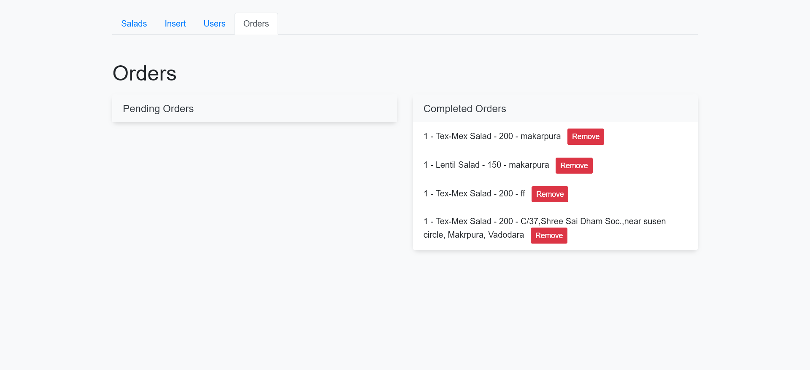

<!-- Readme for online salad ordering website -->
<!-- name of website -->
# Healthy Bytes
## Title: Nutrient-Rich Salad Ordering Platform

### Abstract: 
This online salad ordering website revolutionizes the culinary experience by not only offering a diverse range of salads but also providing detailed insights into their nutrient and protein contents. Users can explore a user-friendly interface that categorizes salads based on protein and nutrition content, allowing for informed and personalized choices. The platform employs concise yet readable variable names in its programming, ensuring efficiency without compromising clarity. Embracing the fusion of technology and nutrition, this innovative solution aims to promote healthier lifestyles and enhance the user's salad selection process.

### How to run:
<!-- how to run a php project in mysql using xmapp -->
1. Download and install XAMPP from https://www.apachefriends.org/download.html
2. Clone the repository into the htdocs folder of XAMPP
3. Start the Apache and MySQL modules in XAMPP
4. Open the phpMyAdmin page in the browser
5. Create a new database called "salad" and import the salad.sql file
6. Open the index.php file in the browser

### Features:
<!-- list of features -->
1. User can login and signup
1. User can view all salads
2. User can view salads by protein content
3. User can view salads by nutrition content
4. User can view salad details
5. User can add salads to cart
6. User can view cart(individual cart will be maintained for each user)
7. User can remove salads from cart
8. User can place order
9. User can view order history

### Screenshots:
<!-- screenshots of the project -->
Signup

Login

Home Page

Salads
.png)

Salad Description

Cart

Checkout

payment Gateway (Razorpay)
 

Order Confirmation

Order Page

#### Admin Panel
Admin can view all salads
.png)

Admin can add salads

Admin can edit salads

Admin can manage orders

Admin can view users

